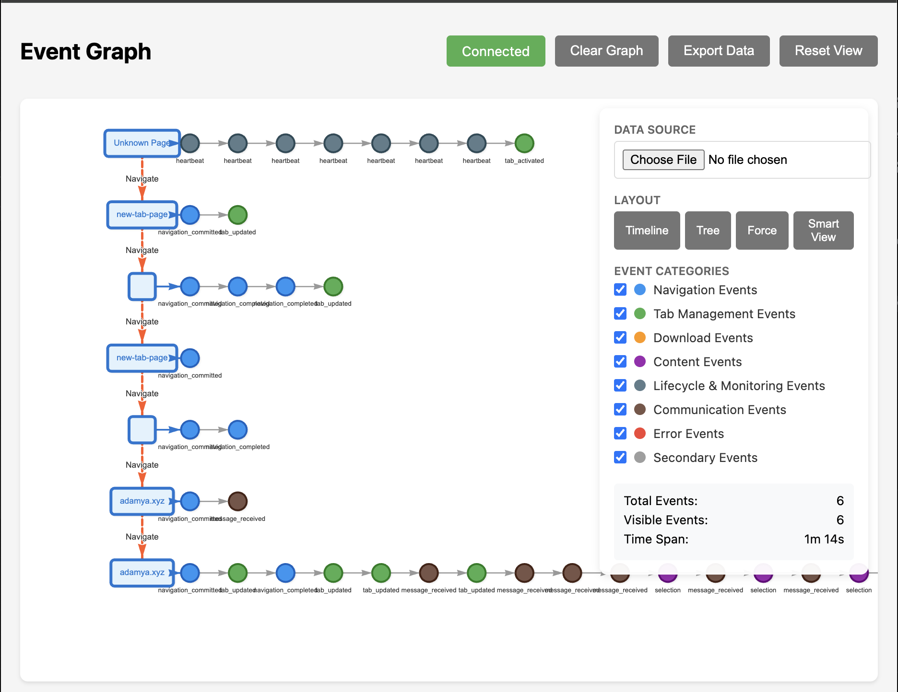

# Research Workflow Logger



*A sample visualization of a research workflow session as a directed event graph.*

A comprehensive Chrome extension for tracking and visualizing user research workflows by monitoring browser activities, navigation patterns, and content interactions.

## 🎯 Purpose

This extension captures detailed telemetry data about research workflows to help understand user behavior patterns, optimize research processes, and potentially train machine learning models on user interaction sequences.

## ✨ Features

### 📊 Real-Time Event Monitoring
- **Comprehensive Event Tracking**: Navigation, tab management, downloads, content selections, and more
- **Live Event Stream**: Real-time visualization of all captured events
- **Event Classification**: Automatically categorizes events by type (Navigation, Content, Downloads, etc.)

### 📈 Graph Visualization
- **Chronological Flow**: Visualize events as a directed graph showing temporal relationships
- **Smart View**: Hierarchical layout that groups events by page visits
- **Multiple Layouts**: Timeline, Tree, and Force-directed graph options
- **Interactive Features**: Click nodes for details, hover for tooltips, zoom and pan

### 🔍 Event Types Tracked
- **Navigation Events**: Page loads, URL changes, search queries
- **Tab Management**: Tab switching, updates, and closures
- **Content Interactions**: Text selections, copy operations, content parsing
- **Downloads**: File downloads with metadata
- **Lifecycle Events**: Extension startup, heartbeats, errors
- **Communication**: Inter-component messaging

### 💾 Data Management
- **JSON Export**: Export event logs for external analysis
- **Real-time Filtering**: Filter events by category
- **Memory Management**: Automatic cleanup with configurable limits
- **Import Support**: Load previously exported event data

## 🚀 Installation

### Method 1: Load Unpacked (Development)
1. Clone or download this repository
2. Open Chrome and navigate to `chrome://extensions/`
3. Enable "Developer mode" in the top right
4. Click "Load unpacked" and select the extension directory
5. The extension icon should appear in your toolbar

### Method 2: CRX Installation (Production)
1. Package the extension as a .crx file
2. Install via Chrome's extension management interface
3. Or distribute through Chrome Web Store

## 📱 Usage

### Opening Event Interfaces
1. **Click the extension icon** in your Chrome toolbar
2. Choose from available options:
   - **"Open Event Stream"**: Real-time list view of all events
   - **"Open Event Graph"**: Interactive graph visualization

### Event Stream Page
- **Monitor Events**: Watch real-time events as they occur
- **Filter by Category**: Use checkboxes to show/hide event types
- **Export Data**: Save current events as JSON file
- **Clear Events**: Reset the event list

### Graph Visualization Page
- **Layout Options**:
  - **Timeline**: Left-to-right chronological flow
  - **Tree**: Top-down hierarchical structure
  - **Force**: Physics-based dynamic layout
  - **Smart View**: Page-grouped hierarchical visualization

- **Interactive Features**:
  - Click nodes to see detailed event information
  - Hover for quick tooltips
  - Use mouse wheel to zoom
  - Drag to pan around the graph

- **Filtering**: 
  - Toggle event categories on/off
  - Import JSON data from files
  - Export current graph data

### Smart View Feature
The Smart View creates a unique hierarchical visualization where:
- Events on the same page are grouped horizontally
- Page navigations create new vertical levels
- Shows clear workflow progression through different pages
- Perfect for understanding user research journeys

## 🏗️ Architecture

### Components
- **Background Service Worker** (`bg.js`): Core event capture and broadcasting
- **Content Scripts** (`content.js`): Page-level event monitoring
- **Event Stream Page** (`stream.html/js`): Real-time event display
- **Graph Visualization** (`graph.html/js`): Interactive graph interface
- **Readability Parser** (`readability.js`): Content extraction and analysis
- **Offscreen Document** (`offscreen.js`): Heavy parsing operations

### Data Flow
```
Content Script Events → Background Service Worker → {
    ├── Event Stream Pages (real-time)
    └── Graph Visualization (real-time)
}

Chrome API Events → Background Service Worker → UI Components
```

### Event Categories
1. **Navigation Events**: URL changes, page loads
2. **Tab Management Events**: Tab operations and state changes
3. **Download Events**: File download tracking
4. **Content Events**: Text selection, copying, content parsing
5. **Lifecycle & Monitoring Events**: Extension health and heartbeats
6. **Communication Events**: Inter-component messaging
7. **Error Events**: Comprehensive error logging
8. **Secondary Events**: Window focus, visibility changes

## 📁 File Structure

```
├── manifest.json           # Extension configuration
├── bg.js                  # Background service worker
├── content.js             # Content script
├── readability.js         # Article parsing library
├── offscreen.html/js      # Off-screen document for heavy processing
├── popup.html/js          # Extension popup interface
├── stream.html/js         # Real-time event stream
├── graph.html/js          # Graph visualization
├── vis-network.min.js     # Vis.js library (local)
├── event-types.md         # Complete event documentation
├── architecture.md        # Detailed architecture documentation
└── README.md              # This file
```

## 📊 Data Privacy & Security

- **No External Servers**: All data stays local by default
- **Minimal Data Collection**: Only captures metadata, not sensitive content
- **User Control**: Users can clear data and control what's tracked
- **Transparent Logging**: All captured data is visible in the event stream

### What We Collect
✅ Page URLs and navigation patterns  
✅ Tab management activities  
✅ Text selections and copy events (up to 1KB)  
✅ Download metadata (filename, URL, MIME type)  
✅ Extension performance metrics  

### What We Don't Collect
❌ Full page content or screenshots  
❌ Passwords or sensitive form data  
❌ Private browsing activity  
❌ Data from other extensions  


## 📜 License

This project is licensed under the MIT License - see the [LICENSE](LICENSE) file for details.