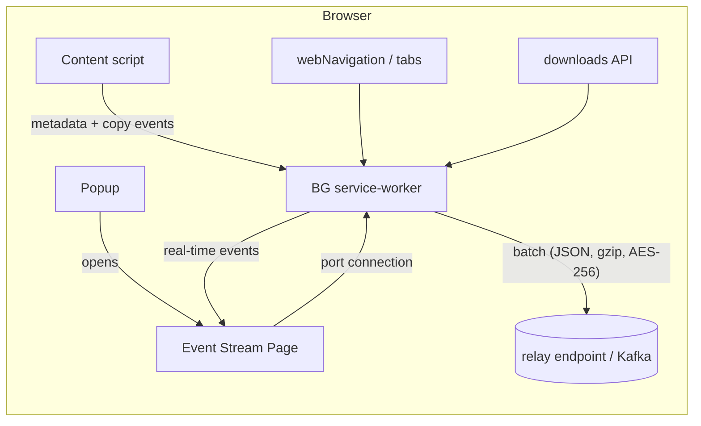

**High-level architecture**



| Layer                                                  | What it does                                                                                                                                                                                                                                                                                                                                                                                                     | Key APIs                                        |
| ------------------------------------------------------ | ---------------------------------------------------------------------------------------------------------------------------------------------------------------------------------------------------------------------------------------------------------------------------------------------------------------------------------------------------------------------------------------------------------------- | ----------------------------------------------- |
| **Content script (injected on every http/https page)** | • Runs *Readability* to pull `<title>`, canonical URL, author, main text <br>• Listens for `selectionchange` → waits for mouse-up → captures selected snippet <br>• Listens for `copy` and grabs pure-text via `event.clipboardData.getData('text')` ([developer.mozilla.org][1]) <br>• Captures visibility changes, window focus/blur, and all errors <br>• Logs content script lifecycle events | `chrome.scripting`, DOM events                  |
| **Background service-worker**                          | • Logs navigation (`onCommitted`, `onCompleted`) and all tab events (`onActivated`, `onUpdated`, `onRemoved`) ([developer.chrome.com][2], [developer.chrome.com][3]) <br>• Captures all download events (`onCreated`, `onChanged`, `onErased`) ([developer.chrome.com][4]) <br>• Broadcasts real-time events to connected stream pages <br>• Maintains heartbeat for active tabs <br>• Comprehensive error handling and logging <br>• Buffers in `chrome.storage.session`, gzip every 30 s or 100 kB, HTTPS-POST to relay | `webNavigation`, `tabs`, `downloads`, `storage`, `runtime.connect` |
| **Event Stream Page**                                  | • Real-time display of all extension events <br>• Connects to background worker via persistent port <br>• Event filtering, clearing, and export functionality <br>• Connection status monitoring with auto-reconnect                                                                                                                                                                                              | `chrome.runtime.connect`, DOM manipulation      |
| **Popup Interface**                                    | • Simple UI to access extension functionality <br>• Button to open event stream page <br>• Extension status display                                                                                                                                                                                                                                                                                             | `chrome.tabs.create`                           |
| **Off-screen doc**                                     | Runs heavy Readability/OEmbed parsing off the UI thread                                                                                                                                                                                                                                                                                                                                                          | `chrome.offscreen`                              |
| **Relay (optional)**                                   | Local service that signs & forwards to on-prem SIEM—avoids direct internet uploads                                                                                                                                                                                                                                                                                                                               | Native Messaging or localhost HTTPS             |

---

### Data the extension actually collects

| Event                        | Captured fields (example)                                   | Notes                                                                           |
| ---------------------------- | ----------------------------------------------------------- | ------------------------------------------------------------------------------- |
| **navigation_committed**     | `{ts, tabId, url, transitionType, searchQuery}`             | `searchQuery` parsed from URL `q=` param when host matches known search engines |
| **navigation_completed**     | `{ts, tabId, url}`                                          | Fires when navigation fully completes                                           |
| **tab_activated**            | `{ts, tabId, url}`                                          | Fires on every `tabs.onActivated`                                               |
| **tab_updated**              | `{ts, tabId, url, changeInfo}`                              | Captures all tab property changes                                                |
| **tab_removed**              | `{ts, tabId, removeInfo}`                                   | Fires when tabs are closed                                                      |
| **readability_snapshot**     | `{ts, tabId, url, title, byline, excerpt, wordCount, hash}` | Hash prevents duplicate storage                                                 |
| **selection**                | `{ts, tabId, url, selectedText}` (≤1 kB)                    | Captures text selections                                                        |
| **copy**                     | `{ts, tabId, url, copiedText}` (≤1 kB)                      | Captures clipboard copy events                                                  |
| **download_created**         | `{ts, filename, url, mime}`                                 | No file bytes collected—only metadata                                           |
| **download_changed**         | `{ts, downloadDelta}`                                       | Tracks download progress and state changes                                       |
| **download_erased**          | `{ts, downloadId}`                                          | Fires when downloads are removed from history                                   |
| **heartbeat**                | `{ts, tabId, url, secondsVisible}`                          | Emitted every 15 s while tab is focused                                         |
| **visibility_change**        | `{ts, state}`                                               | Tracks page visibility (hidden/visible)                                         |
| **window_focus**             | `{ts, state}`                                               | Tracks window focus/blur events                                                 |
| **content_script_loaded**    | `{ts, url}`                                                 | Logs when content script initializes                                            |
| **message_received**         | `{ts, message, sender}`                                     | Logs all inter-component communication                                           |
| **connection**               | `{ts, action, portId}`                                      | Tracks stream page connections/disconnections                                    |
| **error**                    | `{ts, error, details, source, stack}`                      | Comprehensive error logging from all components                                  |
| **extension_startup**        | `{ts}`                                                      | Extension service worker startup                                                 |
| **extension_installed**      | `{ts, details}`                                             | Extension installation/update events                                             |

**What it *cannot* collect (by design)**

* Request/response bodies (MV3 prohibits) ([developer.chrome.com][5])
* Keystrokes outside copy/selection
* Screenshots or pixels
* Activity in other browsers / native apps (unless later augmented with a Native-Messaging clipboard watcher).

---

### Complete `manifest.json` (MV3)

```jsonc
{
  "manifest_version": 3,
  "name": "Research Workflow Logger",
  "version": "0.1.0",
  "description": "Logs research workflows by tracking navigation, tab focus, downloads, and text selections.",
  "permissions": [
    "tabs",
    "webNavigation",
    "history",
    "downloads",
    "clipboardRead",
    "storage",
    "offscreen"
  ],
  "host_permissions": ["*://*/*"],
  "background": { "service_worker": "bg.js" },
  "content_scripts": [{
    "matches": ["http://*/*", "https://*/*"],
    "js": ["readability.js", "content.js"],
    "run_at": "document_idle"
  }],
  "offscreen_document": {
    "url": "offscreen.html",
    "reasons": ["DOM_PARSER"],
    "justification": "Heavy parsing off UI thread"
  },
  "action": {
    "default_popup": "popup.html"
  },
  "web_accessible_resources": [{
    "resources": ["stream.html"],
    "matches": ["<all_urls>"]
  }]
}
```

---

### Real-time Event Stream Architecture

The extension now includes a comprehensive event monitoring system:

| Component                     | Purpose                                                                      | Implementation                                               |
| ----------------------------- | ---------------------------------------------------------------------------- | ------------------------------------------------------------ |
| **Event Broadcasting**        | Real-time event distribution to monitoring pages                             | `chrome.runtime.connect` with persistent ports              |
| **Stream Display Page**       | Visual interface for real-time event monitoring                             | `stream.html` + `stream.js` with auto-reconnection          |
| **Popup Interface**           | Easy access to extension functionality                                       | `popup.html` + `popup.js` with stream page launcher         |
| **Comprehensive Error Handling** | Captures and logs all errors from all components                            | Try-catch blocks + `self.onerror` + `self.onunhandledrejection` |
| **Event Persistence**        | Maintains event history with memory management                               | In-memory storage with 1000-event limit                     |
| **Export Functionality**     | Allows event data export for analysis                                       | JSON export with timestamps                                  |

### Event Flow Architecture

```
Content Script Events → Background Service Worker → {
    ├── Relay Endpoint (batched)
    └── Event Stream Pages (real-time)
}

Chrome API Events → Background Service Worker → {
    ├── Relay Endpoint (batched)  
    └── Event Stream Pages (real-time)
}

Extension Lifecycle → Background Service Worker → Event Stream Pages
```

---

### Why this enhanced design works

| Requirement                                | How it's satisfied                                                                                                                    |
| ------------------------------------------ | ------------------------------------------------------------------------------------------------------------------------------------- |
| **High-level "what, when, where"**         | URLs + Readability metadata give source identity; copy events reveal *what analysts extracted*.                                       |
| **Low friction in locked-down finance IT** | No global hooks or screen capture → passes most extension whitelisting checklists. Only needs CRX ID + policy JSON.                   |
| **Tiny data footprint**                    | Plain-text JSON (+gzip) ≈ –100 kB/hour/analyst.                                                                                       |
| **RL-ready**                               | Every `(state, action)` pair is explicit: state = (last page + snippet history), action = (next URL click / snippet copy / download). |
| **Comprehensive observability**            | Real-time event stream provides complete visibility into extension behavior for debugging and validation.                              |
| **Error resilience**                       | Comprehensive error handling ensures no events are lost and all issues are captured and logged.                                       |
| **Developer experience**                   | Event stream page provides immediate feedback for development, testing, and troubleshooting.                                          |

---

### Usage Instructions

1. **Install Extension**: Load unpacked or install via CRX
2. **Open Event Stream**: Click extension icon → "Open Event Stream"
3. **Monitor Activity**: Browse normally while watching real-time events
4. **Export Data**: Use export button to save event logs as JSON
5. **Debug Issues**: Monitor error events and connection status

### File Structure

```
├── manifest.json           # Extension configuration
├── bg.js                  # Background service worker (main logic)
├── content.js             # Content script (page-level events)
├── readability.js         # Article parsing library
├── offscreen.html         # Off-screen document
├── offscreen.js           # Off-screen processing
├── popup.html             # Extension popup interface
├── popup.js               # Popup functionality
├── stream.html            # Event stream display page
└── stream.js              # Event stream logic
```

---

### Next steps

1. **Enhanced Filtering**: Add event type filters and search functionality to stream page
2. **Performance Monitoring**: Add metrics for extension performance impact
3. **Data Visualization**: Add charts and graphs for event patterns
4. **Advanced Export**: Add CSV export and time-range filtering
5. **Security Hardening**: Implement encryption for sensitive event data
6. **Enterprise Features**: Add admin controls and centralized logging

This enhanced architecture provides a production-ready telemetry system with complete observability, making it ideal for development, debugging, and data collection for ML training.

[1]: https://developer.mozilla.org/en-US/docs/Web/API/ClipboardEvent/clipboardData?utm_source=chatgpt.com "ClipboardEvent: clipboardData property - Web APIs - MDN Web Docs"
[2]: https://developer.chrome.com/docs/extensions/reference/api/webNavigation?utm_source=chatgpt.com "chrome.webNavigation | API - Chrome for Developers"
[3]: https://developer.chrome.com/docs/extensions/reference/api/tabs?utm_source=chatgpt.com "chrome.tabs | API - Chrome for Developers"
[4]: https://developer.chrome.com/docs/extensions/reference/api/downloads?utm_source=chatgpt.com "chrome.downloads | API - Chrome for Developers"
[5]: https://developer.chrome.com/docs/extensions/reference/api/declarativeNetRequest?utm_source=chatgpt.com "chrome.declarativeNetRequest | API - Chrome for Developers"