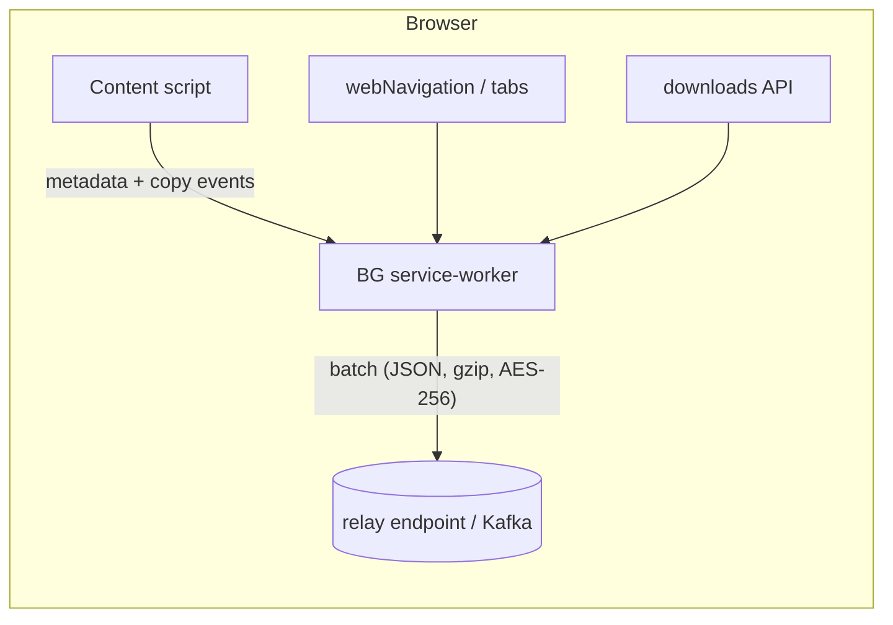

**High-level architecture**



| Layer                                                  | What it does                                                                                                                                                                                                                                                                                                                                                                                                     | Key APIs                                        |
| ------------------------------------------------------ | ---------------------------------------------------------------------------------------------------------------------------------------------------------------------------------------------------------------------------------------------------------------------------------------------------------------------------------------------------------------------------------------------------------------- | ----------------------------------------------- |
| **Content script (injected on every http/https page)** | • Runs *Readability* to pull `<title>`, canonical URL, author, main text <br>• Listens for `selectionchange` → waits for mouse-up → captures selected snippet <br>• Listens for `copy` and grabs pure-text via `event.clipboardData.getData('text')` ([developer.mozilla.org][1])                                                                                                                                | `chrome.scripting`, DOM events                  |
| **Background service-worker**                          | • Logs navigation (`onCommitted`, `onCompleted`) and tab focus (`tabs.onActivated`) ([developer.chrome.com][2], [developer.chrome.com][3]) <br>• Captures each download (`downloads.onCreated`) ([developer.chrome.com][4]) <br>• Merges timeline: **{timestamp, tabId, url, referrer, searchQuery, action, payload}** <br>• Buffers in `chrome.storage.session`, gzip every 30 s or 100 kB, HTTPS-POST to relay | `webNavigation`, `tabs`, `downloads`, `storage` |
| **Off-screen doc**                                     | Runs heavy Readability/OEmbed parsing off the UI thread                                                                                                                                                                                                                                                                                                                                                          | `chrome.offscreen`                              |
| **Relay (optional)**                                   | Local service that signs & forwards to on-prem SIEM—avoids direct internet uploads                                                                                                                                                                                                                                                                                                                               | Native Messaging or localhost HTTPS             |

---

### Data the extension actually collects

| Event                     | Captured fields (example)                                   | Notes                                                                           |
| ------------------------- | ----------------------------------------------------------- | ------------------------------------------------------------------------------- |
| **navigation**            | `{ts, tabId, url, transitionType, searchQuery}`             | `searchQuery` parsed from URL `q=` param when host matches known search engines |
| **focus-switch**          | `{ts, tabId, url}`                                          | Fires on every `tabs.onActivated`                                               |
| **readability\_snapshot** | `{ts, tabId, url, title, byline, excerpt, wordCount, hash}` | Hash prevents duplicate storage                                                 |
| **selection / copy**      | `{ts, tabId, url, selectedText}` (≤1 kB)                    | Throttled to 1 Hz; user can toggle off                                          |
| **download**              | `{ts, filename, url, mime}`                                 | No file bytes collected—only metadata                                           |
| **heartbeat**             | `{ts, tabId, url, secondsVisible}`                          | Emitted every 15 s while tab is focused                                         |

**What it *cannot* collect (by design)**

* Request/response bodies (MV3 prohibits) ([developer.chrome.com][5])
* Keystrokes outside copy/selection
* Screenshots or pixels
* Activity in other browsers / native apps (unless later augmented with a Native-Messaging clipboard watcher).

---

### Minimal `manifest.json` skeleton (MV3)

```jsonc
{
  "manifest_version": 3,
  "name": "Research Workflow Logger",
  "version": "0.1.0",
  "permissions": [
    "tabs",
    "webNavigation",
    "history",
    "downloads",
    "clipboardRead",
    "storage",
    "offscreen"
  ],
  "host_permissions": ["*://*/*"],
  "background": { "service_worker": "bg.js" },
  "content_scripts": [{
    "matches": ["http://*/*", "https://*/*"],
    "js": ["content.js"],
    "run_at": "document_idle"
  }]
}
```

---

### Why this design works

| Requirement                                | How it’s satisfied                                                                                                                    |
| ------------------------------------------ | ------------------------------------------------------------------------------------------------------------------------------------- |
| **High-level “what, when, where”**         | URLs + Readability metadata give source identity; copy events reveal *what analysts extracted*.                                       |
| **Low friction in locked-down finance IT** | No global hooks or screen capture → passes most extension whitelisting checklists. Only needs CRX ID + policy JSON.                   |
| **Tiny data footprint**                    | Plain-text JSON (+gzip) ≈ –100 kB/hour/analyst.                                                                                       |
| **RL-ready**                               | Every `(state, action)` pair is explicit: state = (last page + snippet history), action = (next URL click / snippet copy / download). |

---

### Next steps

1. **Prototype** content + background scripts locally (`Load unpacked`) and verify events.
2. **Add hashing & dedup** to filter repeated article loads.
3. **Implement batching & encryption** (e.g., `crypto.subtle.encrypt` with team public key).
4. **Draft security / compliance doc** listing exact fields, retention, user opt-out flow.
5. **Enterprise sign & pilot** on 2-3 analyst machines via GPO-forced install.

This gives you a production-viable telemetry spine in weeks, ready to scale up the dataset for imitation/RL training without ever touching sensitive keystrokes or desktop hooks.

[1]: https://developer.mozilla.org/en-US/docs/Web/API/ClipboardEvent/clipboardData?utm_source=chatgpt.com "ClipboardEvent: clipboardData property - Web APIs - MDN Web Docs"
[2]: https://developer.chrome.com/docs/extensions/reference/api/webNavigation?utm_source=chatgpt.com "chrome.webNavigation | API - Chrome for Developers"
[3]: https://developer.chrome.com/docs/extensions/reference/api/tabs?utm_source=chatgpt.com "chrome.tabs | API - Chrome for Developers"
[4]: https://developer.chrome.com/docs/extensions/reference/api/downloads?utm_source=chatgpt.com "chrome.downloads | API - Chrome for Developers"
[5]: https://developer.chrome.com/docs/extensions/reference/api/declarativeNetRequest?utm_source=chatgpt.com "chrome.declarativeNetRequest | API - Chrome for Developers"